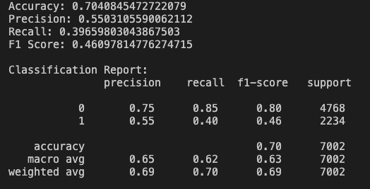
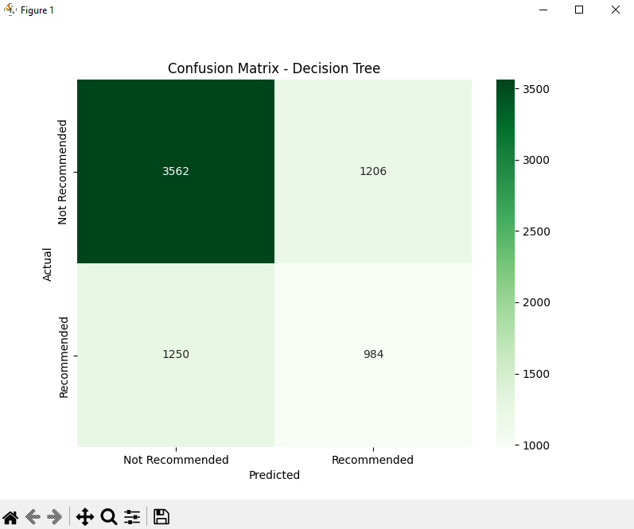

# A3-Movie-Recommendation

1. Definição do Problema
O objetivo deste projeto é desenvolver um sistema de recomendação de filmes que, dado o nome de um filme, utilizando um modelo de aprendizado de máquina. A intenção é recomendar filmes que o usuário possa gostar, considerando atributos do filme, como gênero, idioma original, popularidade e duração.

2. Análise dos Dados
O dataset utilizado é o "TMDB Movies Dataset" da Kaggle, contendo diversas informações sobre filmes, como título, pontuação de avaliação, duração, gênero, popularidade, entre outros. Para simplificar e focar nos aspectos mais relevantes, removemos colunas irrelevantes como id, backdrop_path, imdb_id, poster_path, entre outras. A coluna vote_average foi escolhida como o rótulo alvo para a recomendação. Foi realizada a limpeza dos dados para tratar valores nulos e formatar colunas categóricas.
Baixar dataset atualizado: https://www.kaggle.com/datasets/asaniczka/tmdb-movies-dataset-2023-930k-movies/data

4. Pré-processamento dos Dados
O pré-processamento do dataset incluiu as seguintes etapas:

Remoção de Colunas Desnecessárias: Colunas irrelevantes para a tarefa de recomendação (como título, id, status, etc.) foram removidas.
Tratamento de Dados Faltantes: Valores faltantes nas colunas foram tratados, com destaque para a coluna genres, que foi preenchida com o valor 'unknown' para filmes sem gênero atribuído.
Transformação de Variáveis Categóricas: O gênero dos filmes foi transformado em variáveis categóricas, utilizando One-Hot Encoding para tornar os dados utilizáveis pelo modelo de Random Forest.
Normalização: Algumas colunas, como runtime, popularity, e vote_average, foram normalizadas utilizando StandardScaler para garantir que o modelo pudesse processar as variáveis de forma eficiente.

4. Modelo Base - Random Forest
Para a construção do modelo, foi escolhido o Random Forest, uma técnica de aprendizado supervisionado baseada em múltiplas árvores de decisão. Random Forest combina as previsões de várias árvores de decisão para aumentar a precisão do modelo e reduzir o risco de overfitting.

O modelo de Random Forest foi treinado para prever a avaliação média (vote_average) dos filmes com base nas variáveis de entrada. O modelo foi treinado utilizando 70% dos dados para treinamento e 30% para teste.

5. Avaliação do Modelo Base
Após o treinamento do modelo, realizamos a avaliação de desempenho utilizando as métricas:

Acurácia: 0.7040845472722079
Precisão: 0.5503105590062112
Recall: 0.39659803043867503
F1-Score: 0.46097814776274715




A matriz de confusão mostrou que o modelo tem um bom desempenho, mas com uma certa quantidade de erros, especialmente em filmes com avaliações extremas (muito altas ou muito baixas).



6. Análise dos Resultados
Pontos Fortes: O modelo de Random Forest apresentou uma boa acurácia (70%) e precisão na previsão de filmes com avaliação média mais alta (0). A precisão para a classe 0 (filmes com avaliação alta) foi particularmente boa (75%). A média ponderada de F1-Score também foi razoável (0.69), refletindo um equilíbrio entre precisão e recall.

Pontos Fracos: A principal limitação do modelo é o desempenho mais fraco para filmes com avaliações mais baixas (classe 1). A precisão para a classe 1 foi de 55%, mas o recall foi bem mais baixo (40%). Isso indica que o modelo tem dificuldades em identificar corretamente filmes com avaliações baixas. O F1-Score para a classe 1 ficou em 0.46, refletindo um desempenho abaixo do esperado.

# Melhorias

Foi implementado a Árvore de Decisão para comparação e testes do melhor resultado

Accuracy: 0.6492430734075978
Precision: 0.44931506849315067
Recall: 0.4404655326768129
F1 Score: 0.4448462929475588

Com esses resultados podemos concluir que o Random Forest se mostrou superior a Árvore de Decisão, com a maioria das métricas  um pouco acima tirando o Recall.


## Pré-requisitos

Certifique-se de ter o Python 3 e o `pip` instalados em seu sistema.

## Instalação

1. Clone este repositório:
```git clone https://github.com/anthonyzutter/A3-Movie-Recommendation.git```
```cd A3-Movie-Recommendation```

2. Instale as dependências:
```pip install -r requirements.txt```

3. Execução
```python index.py```